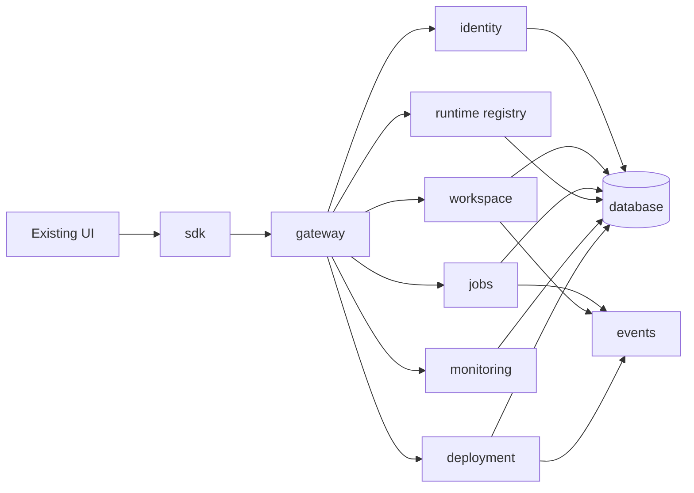

# DAXINI.space Runtime Control Plane

This backend foundation keeps the browser UI static while introducing a modular control plane behind `/api/v1`.

## Architecture

## Service contracts

- `gateway`: validates bearer tokens, resolves workspace context, applies `/api/v1` routing, rate limits requests, normalizes errors, and emits structured request logs.
- `identity`: validates development JWT tokens and resolves permissions without changing login UX.
- `workspace`: enforces server-side workspace isolation for projects, knowledge, memory, agents, jobs, configuration, and deployments.
- `jobs`: represents every AI action as a job with `Created`, `Queued`, `Running`, `Streaming`, `Evaluating`, `Completed`, `Failed`, and `Cancelled` states.
- `runtime`: tracks Reasoning, Knowledge, Memory, Model Router, Execution, Manufacturing, and Evaluation runtimes.
- `monitoring`: exposes dashboard-ready health, queue, latency, request, error, job, workspace activity, and model utilization snapshots.
- `deployment`: tracks Local Runtime, Docker, Remote Runtime, and future Kubernetes deployment state.
- `events`: provides internal `WorkspaceCreated`, `ProjectCreated`, `JobQueued`, `JobStarted`, `JobCompleted`, `DeploymentCreated`, `DeploymentCompleted`, `RuntimeOnline`, and `RuntimeOffline` events.
- `database`: provides the initial in-memory persistence boundary for users, organizations, workspaces, projects, jobs, deployments, runtime registry, audit logs, and configurations.

## API v1

- `GET /api/v1/runtime`
- `GET /api/v1/workspaces`
- `GET /api/v1/monitoring`
- `GET /api/v1/deployments`
- `POST /api/v1/deployments`
- `GET /api/v1/jobs`
- `POST /api/v1/jobs`
- `GET /api/v1/jobs/:id`

All errors use `{ status, error, code, message, details, requestId }` and never expose raw stack traces.

## Migration notes

- Existing pages and navigation are unchanged.
- New frontend runtime calls should use `sdk/index.mjs` instead of direct `fetch()` calls.
- The runtime is lazy and in-memory by default, so it is safe for static deployment and local tests.
- Future adapters can replace `database/index.mjs` without changing service contracts.

## Environment configuration

- `DAXINI_API_BASE_URL`: optional SDK base URL.
- `DAXINI_WORKSPACE_ID`: optional default workspace id.
- `DAXINI_JWT_AUDIENCE`: future production JWT audience.
